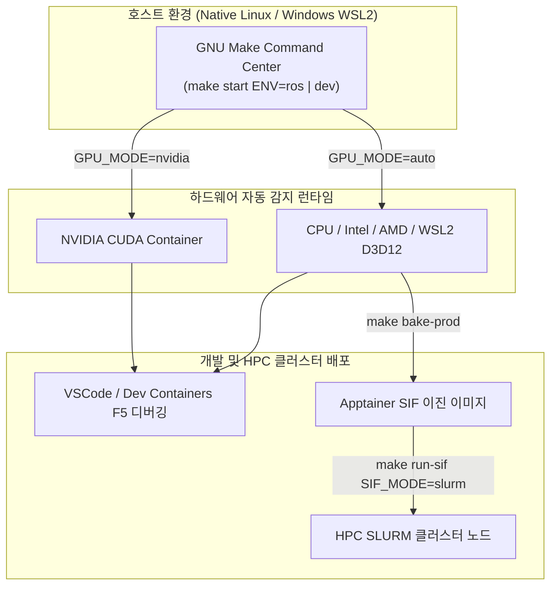

<p align="center">
  
</p>

<h1 align="center">🚀 DevKit: 고성능 로보틱스 & C++/Python 통합 개발 환경</h1>

<p align="center">
  
  
  
  
</p>

> **TL;DR (3줄 요약)**
>
> - **DevKit**은 **Native Linux**, **Windows WSL2**, **macOS (Apple Silicon/Intel)** 환경에서 ROS 1/2, Pure C++, Pure Python 개발을 한 번에 지원하는 워크스페이스 구축 툴킷입니다.
> - GPU 하드웨어(NVIDIA, AMD, Intel, D3D12, macOS Apple Silicon)를 자동 감지하여 최적의 가속 환경을 구성하며, VSCode 디버깅(GDB, debugpy)이 사전 정의되어 있습니다.
> - 로컬 개발 환경을 단 한 줄의 명령으로 **HPC 클러스터(Apptainer SIF &amp; SLURM)** 배치 작업으로 전환합니다.

---

## 📌 핵심 시스템 아키텍처



---

## ⚡ 1분 퀵스타트 (Quick Start)

> **처음엔 5개만 알면 됩니다**: `make setup` → `make build` → `make start` → `make shell`,
> 그리고 컨테이너 안에서 `mksync`. 나머지 타겟은 `make help`, 컨테이너 숏컷은 `h`로 언제든
> 꺼내 볼 수 있으니 외울 필요가 없습니다.

### 1. ROS 2 / ROS 1 개발 환경 시작 (`ENV=ros`)

```bash
# 1) 도커 이미지 빌드 (GPU 자동 감지)
make build ENV=ros

# 2) 개발 컨테이너 기동
make start ENV=ros

# 3) 대화형 셸 진입
make shell ENV=ros
```

### 2. 순수 C++ / Python 개발 환경 시작 (`ENV=dev`)

```bash
make build ENV=dev && make start ENV=dev && make shell ENV=dev
```

### 3. 스타터 예제 노드 실행 (Starter Examples)

컨테이너 셸(`make shell`) 진입 후 사전 탑재된 C++ 및 Python 스타터 예제 노드를 즉시 테스트할 수 있습니다:

```bash
# Python 예제 노드 실행 (ROS 2 및 Pure Python 환경 자동 감지)
python3 src/example/starter_node.py

# C++ 예제 노드 컴파일 및 실행 (단일 파일 예제이므로 컴파일러 직접 호출)
mkdir -p build && g++ -std=c++17 src/example/starter_node.cpp -o build/starter_node
./build/starter_node
```

> [!NOTE]
> `src/example/`의 예제는 **빌드 시스템에 등록되지 않은 독립 파일**입니다. 사용자의 실제 패키지가 프로젝트 타입 판별
> (`package.xml` → ROS / `CMakeLists.txt` → C++)을 온전히 결정하도록 의도한 것으로, 예제를 빌드 대상에 넣으려면
> `src/`에 `package.xml`(ROS) 또는 `CMakeLists.txt`(C++)를 추가한 뒤 `mksync` 또는 `cbuild`/`mbuild`를 실행하세요.

> [!TIP]
> **터미널 명령어 자동 완성 자동 설치**: 호스트에서 `make setup`을 한 번만 실행하면 `~/.bashrc`에 탭 자동완성이 등록되어 `make` 명령어 및 `ENV=`, `SIF_MODE=` 등 모든 옵션의 탭 자동완성이 활성화됩니다 (bash 전용 — zsh 로그인 셸에서는 `bash` 진입 후 사용; `make` 타겟 자체는 셸과 무관하게 동작). 수동 등록: `source config/devkit_make_completion.bash`

### 4. 이 템플릿으로 내 프로젝트 시작하기

DevKit은 **골격**입니다. 복제한 뒤 아래 세 가지는 파생 프로젝트가 소유합니다.

```bash
make setup          # .env 생성 (COMPOSE_PROJECT_NAME 이 사용자명으로 스코프됨)
mksync              # 컨테이너 안에서 1회 — src/uv.lock 이 생성됩니다
git add src/uv.lock && git commit -m "chore: pin python dependencies"
```

> DevKit 저장소 자체는 `src/uv.lock`을 배포하지 않습니다 — 템플릿이 특정 시점의 해석 결과를
> 담으면 모든 fork가 그 스냅샷을 물려받습니다. 완전한 재현이 필요하면 `BASE_IMAGE` 다이제스트와
> `APT_SNAPSHOT_DATE`까지 고정하세요 ([docs/DEVELOPMENT.md](docs/DEVELOPMENT.md#-재현성-reproducibility--현재-보장-범위)).

---

## ⌨️ 주요 명령어 & 숏컷 (Commands & Shortcuts)

### 🖥️ 1. 호스트 명령어 (Host `make` Commands)
호스트 PC 터미널에서 구동 및 제어하는 `make` 타겟 목록입니다.

| 명령 | 기능 및 설명 |
| :--- | :--- |
| **`make setup`** | **초기 세팅**: `.env` 생성, X11 인증 및 탭 자동완성 영구 자동 등록 |
| **`make check`** | **사전 점검**: Docker/Compose v2/BuildKit, `.env` 키 누락, WSL2, NVIDIA 런타임 설정 여부를 해결 명령과 함께 진단 |
| **`make build [ENV=...]`** | **이미지 빌드**: ROS 1/2 (`ENV=ros`) 또는 C++/Python (`ENV=dev`) 도커 이미지 빌드 |
| **`make start [ENV=...]`** | **컨테이너 기동**: 백그라운드 개발 컨테이너 시작 |
| **`make shell / term`** | **컨테이너 진입**: 대화형 셸 진입 / 새 터미널 창 오픈 |
| **`make gpus`** | **호스트 GPU 모니터링**: 호스트 PC의 NVIDIA GPU / iGPU 실시간 VRAM 및 가속 상태 조회 |
| **`make status / check`** | **진단 리포트**: 프로젝트 설정, GPU/GUI 모드, 렌더링 디바이스 종합 점검 |
| **`make verify`** | **무결성 검증**: 문법·Makefile·호스트 감지·APT 태그 필터·셸 환경 동등성·GPG 핀·정리 의미론·SIF 파이프라인 ·보안 기본값 등 **24개 계약**을 실행으로 검증 (0.5초) |
| **`make bake-prod`** | **Apptainer SIF 추출**: 원격 HPC/SLURM 배포용 단일 바이너리 이미지 생성 |
| **`make run-sif`** | **HPC / SLURM 실행**: SIF 이미지를 로컬에서 구동하거나 원격 SLURM 클러스터로 배치 투고 |
| **`make stop / down`** | **컨테이너 중지**: 컨테이너 일시 중지 또는 컨테이너 및 볼륨 완전 삭제 |
| **`make clean-all`** | **환경 초기화**: 빌드 산출물 및 도커 캐시 정밀 클리닝 |

### 🐳 2. 컨테이너 내부 숏컷 (In-Container Shortcuts)
개발 컨테이너 셸(`make shell`) 진입 후 내부에서 사용하는 단축 명령어입니다.

| 명령 | 기능 및 설명 |
| :--- | :--- |
| **`h` / `help`** | **도움말 안내**: 컨테이너 내부 전용 통합 숏컷 및 카테고리 안내 출력 |
| **`mksync [--share]`** | **원클릭 환경 동기화**: 파이썬 venv 생성 + 의존성 설치 + ROS/CMake 빌드 일괄 수행. `--share`는 ROS 1 Noetic 전용 (시스템 파이썬 공유 venv) |
| **`cbuild` / `mbuild`** | **통합 빌드**: `colcon build` / `catkin_make` (ROS) 또는 Modern `cmake` (Pure C++) 실행. `--debug`/`--release`(기본 `RelWithDebInfo`), `--pkg <이름…>`, `--meta`(`config/colcon.meta` 적용) |
| **`cw` / `cs` / `cc`** | **디렉토리 이동**: 워크스페이스 루트(`$WS_ROOT`), `src/`, `config/`로 빠르게 이동 |
| **`gpus` / `gpu <mode>`** | **렌더링 스택 리포트**: OpenGL/GLX·EGL·Vulkan·D3D12 렌더러와 Mesa 버전, 로더 경로, 활성 환경변수 조회 / 가속 모드 전환 |
| **`hwcheck`** | **6섹션 종합 스캔**: 시스템·네트워크·GPU·디스플레이·**신원(uid/gid)과 마운트 권한**·툴체인 (0.8초) |
| **`mkenv` / `activate`** | **Python venv**: `install/.venv` 가상환경 생성 또는 활성화 |
| **`uvs` / `uvr` / `uvp`** | **Python 패키지 관리**: `uv` 기반 초고속 패키지 동기화 / 실행 / 설치 |
| **`uvpython` / `syspython`**| **Python 인터프리터**: venv 파이썬 또는 우분투 시스템 파이썬 구분 실행 |
| **`check_deps`** | **런타임 검사**: `install/` 내 누락된 `*.so` 공유 라이브러리를 `ldd`로 탐지 |
| **`mclean`** | **산출물 정리**: `build/`, `install/`, `log/` 산출물 디렉토리만 안전하게 삭제 |


---

## 🎮 하드웨어 &amp; GPU 지원 모드

`GPU_MODE` 환경변수를 통해 사용자의 하드웨어를 자동으로 감지합니다 (`.env` 제어 가능).

- **`GPU_MODE=auto`** (기본값): 아래 순서로 하드웨어를 감지해 모드를 선택합니다.
  `nvidia`(dGPU) → `tegra`(Jetson) → `amd`(ROCm) → `intel`/`amd`(DRI) → `igpu`(WSL2 D3D12) → `cpu`.
- **`GPU_MODE=nvidia`**: NVIDIA Container Toolkit 기반 하드웨어 가속 (OpenGL + Vulkan + EGL).
- **`tegra`**: NVIDIA Jetson / Tegra 내장 GPU (L4T 스택, `/dev/nvhost-*`).
  Jetson은 `/dev/nvidiactl`이 없어 일반 NVIDIA 탐지로는 잡히지 않으므로 별도 경로로 처리합니다.
  호스트의 `GPU_MODE`(compose 프로파일)에는 없는 컨테이너 내부 모드이며, `auto` 탐지 또는 `gpu tegra`로 선택됩니다.
- **`GPU_MODE=intel` / `amd` / `igpu`**: Mesa iris·xe / radeonsi / `/dev/dri` 패스스루. WSL2에서는 모든 벤더가 Mesa D3D12(Dozen) 브리지를 경유합니다.
  `igpu`는 **벤더 무관 폴백**이기도 합니다 — Mali(panfrost)·Adreno(freedreno)·VideoCore(v3d)·Vivante(etnaviv) 등
  SoC GPU는 PCI 벤더 ID가 없는 platform 디바이스라 벤더 탐지에 걸리지 않으므로, 렌더 노드만 있으면
  드라이버 오버라이드 없이 Mesa에 위임합니다. 실제 커널 DRM 드라이버명은 `hwcheck`/`gpus`가 표시합니다.
- **`GPU_MODE=cpu`**: GPU가 없는 환경이나 CI/CD 서버를 위한 LLVMpipe 소프트웨어 렌더링.

> [!NOTE]
> **macOS(Apple Silicon 포함)에는 컨테이너 GPU 가속이 존재하지 않습니다.** Docker Desktop / OrbStack은 Linux VM에서
> 동작하며 Metal·MPS를 컨테이너로 전달할 수단이 없습니다(플랫폼 제약이며 설정 오류가 아닙니다). 따라서 macOS에서는
> 항상 `cpu`(LLVMpipe)로 동작하고, `hwcheck`는 이를 오류가 아닌 정보로 안내합니다.
> **MPS 가속이 필요한 PyTorch 작업은 컨테이너가 아니라 호스트 macOS에서 네이티브로 실행**하세요.
> 컨테이너는 CPU 빌드·ROS·CI 용도로는 그대로 사용 가능합니다. (`arm64` 자체는 Jetson/Graviton 등에서 정상 지원됩니다.)

### 자동으로 연결되는 호스트 리소스

`scripts/check_env.sh`가 호스트를 1회 감지하여 `.docker_cache/detected-env.mk`에 캐시하고, 그 값으로 아래 마운트가 결정됩니다.
감지에 실패한 항목은 호스트를 오염시키지 않도록 `.docker_cache/dummy_*` 플레이스홀더로 대체됩니다.

| 호스트 리소스 | 컨테이너 매핑 | 비고 |
| :--- | :--- | :--- |
| `/dev/dri`, `/dev/dxg` | 동일 경로 | GPU 렌더 노드 / WSL2 D3D12 디바이스 |
| `/usr/lib/wsl` | `/usr/lib/wsl` (ro) | **WSL2 필수** — `libcuda`/`libd3d12` 호스트 라이브러리 |
| `/tmp/.X11-unix` 또는 `/mnt/wslg/.X11-unix` | `/tmp/.X11-unix` | X11 소켓 (WSLg 자동 판별) |
| `$XDG_RUNTIME_DIR` 또는 `/mnt/wslg/runtime-dir` | `/tmp/.container_xdg` | Wayland 소켓 |
| `$XAUTHORITY` | `/tmp/.container_xauth` (ro) | X11 인증 |
| `$SSH_AUTH_SOCK` | `/tmp/ssh-auth.sock` (ro) | ssh-agent 포워딩 |
| `~/.gitconfig` | `~/.gitconfig` (ro) | 호스트 git 신원 |
| 호스트 UID/GID | 컨테이너 사용자 UID/GID | 바인드 마운트 권한 일치 |

> [!IMPORTANT]
> 감지 결과는 `.docker_cache/detected-env.mk`에 **캐시**됩니다 (첫 실행 ~90ms, 이후 ~3ms).
> GPU를 새로 장착하거나 `ssh-agent`를 새로 띄우는 등 **호스트 환경이 바뀌면 `make clean-cache`** 로 재감지시키세요.
> 현재 감지 결과 전체는 **`make status`** 의 `[Detected Host Wiring]` 섹션에서 확인할 수 있습니다.
>
> 감지 실패 시 캐시는 **기록되지 않고 make가 즉시 중단**되므로(원자적 쓰기), 부분 감지 결과가 조용히 재사용되는 일은 없습니다.
> `help`/`setup`/`verify`/`clean*`/`down`/`logs`/`stop`/`slurm-*` 타겟은 감지를 아예 건너뛰어 프로브 비용을 내지 않습니다.

---

## 🧹 용량 누수 방지 &amp; 볼륨 정리 (Disk Cleanup)

- **`make clean`**: `build/`, `log/`, `install/`의 빌드 산출물과 워크스페이스 편의 심볼릭 링크
  (`compile_commands.json`, `.venv`, `colcon.meta` — 컨테이너 진입 시 자동 재생성) 정리.
  **`install/.venv`(파이썬 가상환경)는 보존**합니다 —
  재생성에 `mksync` 전체가 필요하기 때문입니다. 가상환경까지 지우려면 `make clean KEEP_VENV=0` (확인 프롬프트 있음).
  기본 구성에서 `build/install/log`는 **named 볼륨**이라 컨테이너 쪽 산출물은 `make clean-all`이 제거합니다.
- **`make clean-all`**: 컨테이너 · 프로젝트 전용 Named Volume · **compose가 빌드한 이 프로젝트 이미지**까지 제거하여 완전 초기화
  (`--rmi local`이라 다른 프로젝트 이미지는 건드리지 않음). 확인 프롬프트 있음.
  **`make clean-all KEEP_VENV=1`** 은 가상환경이 담긴 `install` 볼륨만 남겨, 재빌드 후 접속하면 `mksync` 없이 바로 사용할 수 있습니다.
- **`make stop` / `make down`**: `ENV`에 해당하는 서비스만 대상으로 합니다 (`ENV=ros` 실행 시 `basic-*` 컨테이너는 건드리지 않음).
- **`make docker-clean`**: **고아 이미지, BuildKit 빌드 캐시 및 미사용 볼륨 전체 삭제** (수십 GB 용량 복구).

## 📖 상세 매뉴얼 및 문서 안내

자세한 기능 설명 및 고급 서버 배포법은 아래 전문 문서를 참조하세요:

- 📘 [**개발자 워크플로우 &amp; 숏컷 상세 가이드 (docs/DEVELOPMENT.md)**](docs/DEVELOPMENT.md)
  - `mksync` 가동 순서, `pyproject.toml` 연동, 파이썬 패키지 관리 (`uv`), SIF 생성 옵션 상세.
- 🛰️ [**원격 서버 &amp; SLURM 클러스터 배포 매뉴얼 (docs/SLURM.md)**](docs/SLURM.md)
  - Apptainer SIF 빌드 및 원격 서버 스토리지 분리 구조, `sbatch` 배치 작업 제출, 실시간 로그 모니터링.
- 🤝 [**기여 가이드 (CONTRIBUTING.md)**](CONTRIBUTING.md)
  - 커밋·주석 규약, 계약을 추가하는 방법(뮤테이션 테스트), 표면을 늘릴 때 함께 갱신할 것.
- 🤖 [**LLM 코딩 에이전트 지침 (docs/GEMINI.md)**](docs/GEMINI.md)
  - 이 저장소에서 LLM 에이전트에게 요구하는 작업 규칙(가정 명시, 최소 구현, 국소 변경, 검증 가능한 목표).
- 🐞 [**디버깅 &amp; 트러블슈팅 가이드 (docs/DEBUGGING.md)**](docs/DEBUGGING.md)
  - VSCode GDB/debugpy 디버거 세팅, X11/Wayland GUI 권한 문제 해결, `check_deps` 의존성 검사법.

