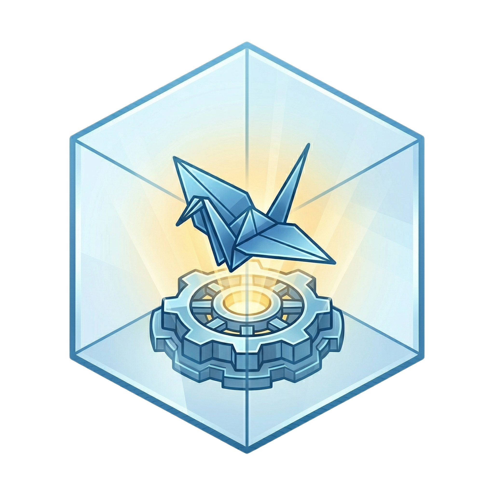

<p align="center">
  
</p>

<h1 align="center">🚀 DevKit: 고성능 로보틱스 & C++/Python 통합 개발 환경</h1>

<p align="center">
  
  
  
  
</p>

> **TL;DR (3줄 요약)**
>
> - **DevKit**은 **Native Linux**, **Windows WSL2**, **macOS (Apple Silicon/Intel)** 환경에서 ROS 2, ROS 1 noetic, Pure C++, Pure Python 개발을 한 번에 지원하는 워크스페이스 **템플릿**입니다 (ROS 1 은 레거시 티어 — 지원·검증되지만 새 기능은 ROS 2 에만).
> - GPU 하드웨어(NVIDIA, AMD, Intel, WSL2 D3D12)를 자동 감지하여 가속 환경을 구성하고, VS Code 디버깅(GDB, debugpy)이 사전 정의되어 있습니다.
> - 로컬 개발 환경을 한 줄의 명령으로 **HPC 클러스터(Apptainer SIF &amp; SLURM)** 배치 작업으로 전환합니다.

---

## 📌 핵심 시스템 아키텍처


---

## ⚡ 1분 퀵스타트 (Quick Start)

> **처음엔 5개만 알면 됩니다**: `make setup` → `make build` → `make start` → `make shell`,
> 그리고 컨테이너 안에서 `mksync`. 나머지 타겟은 `make help`, 컨테이너 숏컷은 `h`로 언제든
> 꺼내 볼 수 있으니 외울 필요가 없습니다.

```bash
# 0) 최초 1회: .env 생성 + X11 인증 + 탭 자동완성 등록 + VS Code 연결 설정
make setup

# 1) 이미지 빌드 (GPU 자동 감지) → 2) 컨테이너 기동 → 3) 대화형 셸
make build ENV=ros && make start ENV=ros && make shell ENV=ros    # ROS 2
make build ENV=dev && make start ENV=dev && make shell ENV=dev    # 순수 C++ / Python

# 4) 컨테이너 안에서: venv + 의존성 + 빌드를 한 번에
mksync
```

> [!IMPORTANT]
> `make setup`을 먼저 실행하세요. `.env`는 git 에 포함되지 않으므로 새 클론에는 없고,
> 없으면 `make build`가 `.env file missing. Run 'make setup' first.`로 멈춥니다.
> `make setup`은 `~/.bashrc`에 `make` 탭 완성(타겟과 `ENV=`, `SIF_MODE=` 같은 옵션)도 등록합니다 — bash 전용이며,
> zsh 에서는 `bash`로 들어와 쓰거나 `source config/devkit_make_completion.bash`로 직접 등록합니다.

**이 템플릿으로 내 프로젝트를 시작한다면** — 정체성(`make adopt`), 팀 공유 `.env.example`, 의존성 세 레이어, lock 커밋,
`project.yml`, 스타터 예제 정리까지 순서대로: [docs/GETTING_STARTED.md](docs/GETTING_STARTED.md).

---

## ⌨️ 주요 명령어 & 숏컷 (Commands & Shortcuts)

### 🖥️ 1. 호스트 명령어 (Host `make` Commands)
호스트 PC 터미널에서 구동 및 제어하는 `make` 타겟 목록입니다. 전체 목록은 `make help`.

| 명령 | 기능 및 설명 |
| :--- | :--- |
| **`make setup`** | **초기 세팅**: `.env` 생성, X11 인증, 탭 자동완성 등록, VS Code 연결 설정(`ide-config`) |
| **`make adopt NAME=…`** | **정체성**: 이 체크아웃을 내 프로젝트로 — `pyproject.toml`·`.env`의 이름을 한 번에 ([시작하기](docs/GETTING_STARTED.md)) |
| **`make check`** | **사전 점검**: Docker/Compose v2/BuildKit, `.env` 키 누락, WSL2, NVIDIA 런타임 설정 여부를 해결 명령과 함께 진단 |
| **`make build [ENV=...]`** | **이미지 빌드**: ROS (`ENV=ros`) 또는 C++/Python (`ENV=dev`) 도커 이미지 빌드 |
| **`make start [ENV=...]`** | **컨테이너 기동**: 백그라운드 개발 컨테이너 시작 |
| **`make shell / term`** | **컨테이너 진입**: 대화형 셸 진입 / 새 터미널 창 오픈 (`term`은 opt-in — [되살리기](docs/DEPENDENCIES.md#-opt-in-기능-되살리기)) |
| **`make exec CMD='…'`** | **명령 실행**: 컨테이너 안에서 DevKit 환경 그대로 한 명령 실행 (자동화의 기본 경로) |
| **`make gpus`** | **호스트 GPU 모니터링**: 호스트 PC의 NVIDIA GPU / iGPU 실시간 VRAM 및 가속 상태 조회 |
| **`make status`** | **진단 리포트**: 프로젝트 설정, 감지된 호스트 배선, 실행 중 컨테이너 (`check` 를 먼저 수행) |
| **`make test / lint`** | **품질 루프**: 프로젝트 테스트 실행 / 스타일·린트 검사 (`FIX=1`로 자동 수정). 러너는 워크스페이스 형태(ROS·CMake·순수 Python)에서 자동 결정 |
| **`make ci / ci-on / ci-off`** | **CI 스위치**: GitHub Actions 워크플로의 상태 표시 / 일괄 켜기 / 일괄 끄기 (`gh` 로그인 필요; `make status`에도 한 줄) |
| **`make verify`** | **무결성 검증**: 문법·Makefile·호스트 감지·APT 태그 필터·셸 환경 동등성·GPG 핀·정리 의미론·SIF 파이프라인·IDE 설정·보안 기본값 등 **58개 계약**을 실행으로 검증 |
| **`make bake-prod`** | **Apptainer SIF 추출**: 원격 HPC/SLURM 배포용 단일 바이너리 이미지 생성 |
| **`make run-sif`** | **HPC / SLURM 실행**: SIF 이미지를 로컬에서 구동하거나 원격 SLURM 클러스터로 배치 투고 |
| **`make stop / down`** | **컨테이너 중지**: 선택한 `ENV`의 컨테이너 중지 / 제거 |
| **`make clean / clean-all`** | **정리**: 빌드 산출물 정리 / 컨테이너·볼륨·이미지·캐시까지 완전 초기화 ([정리와 초기화](docs/DEVELOPMENT.md#-정리와-초기화-cleanup)) |

### 🐳 2. 컨테이너 내부 숏컷 (In-Container Shortcuts)
개발 컨테이너 셸(`make shell`) 진입 후 내부에서 사용하는 단축 명령어입니다. 전체 목록은 `h`.

| 명령 | 기능 및 설명 |
| :--- | :--- |
| **`h` / `help`** | **도움말 안내**: 컨테이너 내부 전용 통합 숏컷 및 카테고리 안내 출력 |
| **`mksync [--share]`** | **원클릭 환경 동기화**: 파이썬 venv 생성 + 의존성 설치 + ROS/CMake 빌드 일괄 수행. `--share`는 ROS 이미지에서 자동 적용 (시스템 파이썬 공유 venv — `rospy`/`rclpy`가 시스템에 있음) |
| **`cbuild` / `mbuild`** | **통합 빌드**: `colcon build` / `catkin_make` (ROS) 또는 Modern `cmake` (Pure C++) 실행. `--debug`/`--release`(기본 `RelWithDebInfo`), `--pkg <이름…>`, `--meta`(`config/colcon.meta` 적용) |
| **`cw` / `cs` / `cc`** | **디렉토리 이동**: 워크스페이스 루트(`$WS_ROOT`), `src/`, `config/`로 빠르게 이동 |
| **`gpus` / `gpu <mode>`** | **렌더링 스택 리포트**: OpenGL/GLX·EGL·Vulkan·D3D12 렌더러와 Mesa 버전, 로더 경로, 활성 환경변수 조회 / 가속 모드 전환 |
| **`hwcheck`** | **6섹션 종합 스캔**: 시스템·네트워크·GPU·디스플레이·**신원(uid/gid)과 마운트 권한**·툴체인 |
| **`mkenv` / `activate`** | **Python venv**: `install/.venv` 가상환경 생성 또는 활성화 |
| **`uvs` / `uvr` / `uvp`** | **Python 패키지 관리**: `uv` 기반 패키지 동기화 / 실행 / 설치 |
| **`uvpython` / `syspython`**| **Python 인터프리터**: venv 파이썬 또는 우분투 시스템 파이썬 구분 실행 |
| **`check_deps`** | **런타임 검사**: `install/` 내 누락된 `*.so` 공유 라이브러리를 `ldd`로 탐지 |
| **`mtest` / `mlint`** | **품질 루프**: `colcon test`·`ctest`·`pytest` 중 프로젝트에 맞는 러너 실행 / `ruff`+`clang-format` 규칙 검사 (`mlint --fix`로 수정). 규칙은 `.editorconfig`가 SSOT |
| **`mclean`** | **산출물 정리**: `build/`, `devel/`, `log/`, `install/` 산출물만 비움 (venv 는 `--all`에서만) |

---

## 🎮 하드웨어 &amp; GPU 지원 모드

`GPU_MODE` 환경변수를 통해 사용자의 하드웨어를 자동으로 감지합니다 (`.env` 제어 가능).

- **`GPU_MODE=auto`** (기본값): 아래 순서로 하드웨어를 감지해 모드를 선택합니다.
  `nvidia`(dGPU) → `tegra`(Jetson) → `amd`(ROCm) → `intel`/`amd`(DRI) → `igpu`(WSL2 D3D12) → `cpu`.
- **`GPU_MODE=nvidia`**: NVIDIA Container Toolkit 기반 하드웨어 가속 (OpenGL + Vulkan + EGL).
- **`tegra`**: NVIDIA Jetson / Tegra 내장 GPU (L4T 스택, `/dev/nvhost-*`).
  Jetson은 `/dev/nvidiactl`이 없어 일반 NVIDIA 탐지로는 잡히지 않으므로 별도 경로로 처리합니다.
  호스트의 `GPU_MODE`(compose 프로파일)에는 없는 컨테이너 내부 모드이며, `auto` 탐지 또는 `gpu tegra`로 선택됩니다.
- **`GPU_MODE=intel` / `amd` / `igpu`**: Mesa iris·xe / radeonsi / `/dev/dri` 패스스루. WSL2에서는 모든 벤더가 Mesa D3D12(Dozen) 브리지를 경유합니다.
  `igpu`는 **벤더 무관 폴백**이기도 합니다 — Mali(panfrost)·Adreno(freedreno)·VideoCore(v3d)·Vivante(etnaviv) 등
  SoC GPU는 PCI 벤더 ID가 없는 platform 디바이스라 벤더 탐지에 걸리지 않으므로, 렌더 노드만 있으면
  드라이버 오버라이드 없이 Mesa에 위임합니다. 실제 커널 DRM 드라이버명은 `hwcheck`/`gpus`가 표시합니다.
- **`GPU_MODE=cpu`**: GPU가 없는 환경이나 CI/CD 서버를 위한 LLVMpipe 소프트웨어 렌더링.

> [!NOTE]
> **macOS(Apple Silicon 포함)에는 컨테이너 GPU 가속이 존재하지 않습니다.** Docker Desktop / OrbStack은 Linux VM에서
> 동작하며 Metal·MPS를 컨테이너로 전달할 수단이 없습니다(플랫폼 제약이며 설정 오류가 아닙니다). 따라서 macOS에서는
> 항상 `cpu`(LLVMpipe)로 동작하고, `hwcheck`는 이를 오류가 아닌 정보로 안내합니다.
> **MPS 가속이 필요한 PyTorch 작업은 컨테이너가 아니라 호스트 macOS에서 네이티브로 실행**하세요.
> 컨테이너는 CPU 빌드·ROS·CI 용도로는 그대로 사용 가능합니다. (`arm64` 자체는 Jetson/Graviton 등에서 정상 지원됩니다.)

### 자동으로 연결되는 호스트 리소스

`scripts/check_env.sh`가 호스트를 1회 감지하여 `.docker_cache/detected-env.mk`에 캐시하고, 그 값으로 아래 마운트가 결정됩니다.
감지에 실패한 항목은 호스트를 오염시키지 않도록 `.docker_cache/dummy_*` 플레이스홀더로 대체됩니다.

| 호스트 리소스 | 컨테이너 매핑 | 비고 |
| :--- | :--- | :--- |
| `/dev/dri`, `/dev/dxg` | 동일 경로 | GPU 렌더 노드 / WSL2 D3D12 디바이스 |
| `/usr/lib/wsl` | `/usr/lib/wsl` (ro) | **WSL2 필수** — `libcuda`/`libd3d12` 호스트 라이브러리 |
| `/tmp/.X11-unix` 또는 `/mnt/wslg/.X11-unix` | `/tmp/.X11-unix` | X11 소켓 (WSLg 자동 판별) |
| `$XDG_RUNTIME_DIR` 또는 `/mnt/wslg/runtime-dir` | `/tmp/.container_xdg` | Wayland 소켓 |
| `$XAUTHORITY` | `/tmp/.container_xauth` (ro) | X11 인증 |
| `$SSH_AUTH_SOCK` | `/tmp/ssh-auth.sock` (ro) | ssh-agent 포워딩 |
| `~/.gitconfig` | `~/.gitconfig` (ro) | 호스트 git 신원 |
| 호스트 UID/GID | 컨테이너 사용자 UID/GID | 바인드 마운트 권한 일치 |

> [!IMPORTANT]
> 감지 결과는 `.docker_cache/detected-env.mk`에 **캐시**됩니다 (첫 실행 ~90ms, 이후 ~3ms).
> GPU를 새로 장착하거나 `ssh-agent`를 새로 띄우는 등 **호스트 환경이 바뀌면 `make clean-cache`** 로 재감지시키세요.
> 현재 감지 결과 전체는 **`make status`** 의 `[Detected Host Wiring]` 섹션에서 확인할 수 있습니다.
>
> 감지 실패 시 캐시는 **기록되지 않고 make가 즉시 중단**되므로(원자적 쓰기), 부분 감지 결과가 조용히 재사용되는 일은 없습니다.
> `help`/`setup`/`adopt`/`verify`/`clean*`/`down`/`logs`/`stop`/`slurm-*`/`run-sif` 등 컨테이너를 만들지 않는 타겟은 감지를 건너뛰어 프로브 비용을 내지 않습니다(목록은 Makefile 의 `DETECTOR_EXEMPT`).

---

## ✅ 지원 범위 (Support Matrix)

무엇이 **실행으로 확인**되었고 무엇이 아직 아닌지를 구분합니다. 근거는 세 가지입니다 — `make verify`(58개 계약),
`.github/workflows/` 의 잡(정의만 되고 아직 실행되지 않은 것은 그렇게 표시), 그리고 아래의 **참조 호스트** 실측입니다.

> **참조 호스트**: WSL2 (커널 6.18, Ubuntu 24.04) · NVIDIA RTX 4060 Ti · Docker + nvidia-container-toolkit · X11 `:0`.
> 여기서 `make build/start/exec ENV=ros`(auto → **nvidia** 프로필), ROS 2 humble `rclpy` import 와 205개 패키지,
> 컨테이너 안 `nvidia-smi` 의 GPU 인식, `glxinfo` 가 보고한 `D3D12 (NVIDIA GeForce RTX 4060 Ti)`(llvmpipe 폴백 아님),
> `xdpyinfo` X11 연결, 스타터 예제(Python·C++)와 pytest, 그리고 prod SIF 굽기·실행·작업 기록까지 실제로 통과했습니다.
>
> SLURM 은 컨테이너에 **클러스터**(slurmctld + slurmd + munge)를 세워 확인했습니다 — `make run-sif SIF_MODE=slurm`
> 의 `sbatch` 플래그 수용, `%x_%j` 로그 경로, 할당 안에서의 `srun` 사용, 실제 부여된 자원(`partition`/`cpus_per_task`/`mem`)
> 기록, 그리고 작업 종료 코드 **0 과 7 의 전파**까지 통과했습니다. 노드를 둘로 늘린 클러스터에서는
> `--nodes=2 --ntasks=2` 작업이 각 노드에서 한 태스크씩 실행되고 기록에 `nodelist=c[1-2]` 가 남았습니다.
> 이 노드에서는 중첩 user namespace 를 쓸 수 없어
> **컨테이너 런타임만 스텁**이며, 따라서 "SIF 가 계산 노드에서 실행된다"는 별개로 남습니다.
>
> arm64 는 QEMU(binfmt) 로 `base` 스테이지를 빌드해 실제로 실행했습니다 — `uname -m` = `aarch64`,
> 계정이 `uid=1000(user)` 로 생성됨, `sif_arch` 가 붙이는 아티팩트 접미사와 일치.
>
> **근거의 세 등급**을 구분합니다 — `CI(실행됨)` 은 GitHub Actions 에서 실제로 통과한 잡,
> `참조 호스트` 는 위 머신에서의 실측, `정의만, 미실행` 은 워크플로우에 잡은 있으나 아직
> 한 번도 트리거되지 않은 것입니다 — 무거운 잡(runtime-smoke, prod-artifact, sif-artifact, arm64)은
> cron·수동 전용이며, 위 표의 상태는 `workflow_dispatch` 로 실제 실행해 확인한 결과입니다. CI 러너는 Ubuntu 와 macOS
> 두 종류이며 WSL2 러너는 없으므로, WSL2 행은 참조 호스트 실측만이 근거입니다
> ([CI 구성](docs/DEVELOPMENT.md#-ci-github-actions)).

| 조합 | 상태 | 근거 |
| :--- | :--- | :--- |
| 이미지 스테이지 빌드 (`base`, `build-core`) | ✅ 실행 검증 | CI(실행됨) `images.yml` image-stages |
| Dockerfile apt 목록이 20.04 · 22.04 · 24.04 에서 해석 | ✅ 실행 검증 | CI(실행됨) `images.yml` apt-lists-resolve |
| ROS 저장소·GPG (humble, 라이브 및 스냅샷 키; noetic) | ✅ 실행 검증 | CI(실행됨) `images.yml` apt-key-paths |
| **ROS 1 noetic** (레거시 티어 — EOL 2025-05, 동작은 유지·검증되나 새 기능은 ROS 2 에만) | ✅ 실행 검증 — 계약(`build-entrypoints`·`workspace-overlay`)과 apt 키 경로 | CI(실행됨) · `make verify` |
| 계약 스위트 58개 · Dockerfile 린트 | ✅ 실행 검증 | CI(실행됨) `verify.yml` contracts |
| 개발 컨테이너 스모크 (빌드 · 기동 · ROS 2 파이썬) | ✅ 실행 검증 | CI(실행됨) `images.yml` runtime-smoke · 참조 호스트 |
| WSL2 호스트: 감지 · 빌드 · 실행 (ROS 2) | ✅ 실행 검증 | 참조 호스트 |
| NVIDIA GPU 패스스루 (`nvidia-smi`, `libcuda`) | ✅ 실행 검증 — **WSL2 경로만**. 네이티브 Linux 는 장치 노드가 달라(`/dev/nvidia*`) 별개 | 참조 호스트 |
| GUI · GL 가속 (X11, WSLg/D3D12) | ✅ 실행 검증 — **WSL2 경로만** | 참조 호스트 |
| 프로덕션 런타임 이미지 (non-root, venv) — dev · ros | ✅ 실행 검증 | CI(실행됨) `images.yml` prod-artifact · 참조 호스트 |
| SIF 변환 · 실행 · 작업 기록 | ✅ 실행 검증 | CI(실행됨) `images.yml` sif-artifact · 참조 호스트 |
| SLURM 제출 · 실행 · 종료 상태 기록 | ✅ 실행 검증 — 컨테이너 클러스터. **컨테이너 런타임만 스텁** | 참조 호스트 |
| **다중 노드 SLURM** (`--nodes=2`, 노드별 태스크 배치) | ✅ 실행 검증 — 2노드 컨테이너 클러스터 | 참조 호스트 |
| arm64 이미지: 빌드 · 실행 · 계정 생성 | ✅ 실행 검증 — **QEMU 에뮬레이션** | CI(실행됨) `images.yml` arm64-image · 참조 호스트 |
| 네이티브 Linux 호스트 감지 (`IS_WSL=false`, GPU 플래그, DXG 마운트 중립화) | ✅ 실행 검증 | CI(실행됨) `verify.yml` contracts |
| macOS 호스트 (bash 3.2 · BSD sed/awk) | ✅ 실행 검증 | CI(실행됨) `verify.yml` macos-host |
| macOS GPU (Metal/MPS) | ❌ **미지원** — CPU 폴백으로만 동작 | — |
| MPI 통신 | ❌ **미지원** — `srun` 이 노드에 태스크를 띄우는 것까지는 동작하나 `--mpi`/PMI 배선이 없어 태스크 간 통신은 애플리케이션 몫 | — |

> ROS 배포판은 Ubuntu 릴리스와 Python 인터프리터를 함께 결정합니다
> (20.04/noetic·foxy → 3.8, 22.04/humble·iron → 3.10, 24.04/jazzy·kilted·rolling → 3.12).
> `ROS_DISTRO` 하나만 바꾸면 나머지가 따라옵니다 — apt 가 `rclpy`/`rospy` 를 시스템
> 인터프리터에 넣기 때문에 이 짝이 어긋나면 venv 가 ROS 를 import 하지 못합니다.

---

## 📖 문서 안내

문서는 두 곳에만 있습니다 — **`docs/`** 는 DevKit 을 *쓰는* 법, **`.github/`** 는 DevKit 에
*기여하는* 법입니다. 루트에는 `README.md` 와 `LICENSE` 만 둡니다. 각 주제는 한 문서만이 소유하고
나머지는 그곳으로 링크합니다.

| 문서 | 소유하는 주제 |
| :--- | :--- |
| 🧭 [docs/GETTING_STARTED.md](docs/GETTING_STARTED.md) | 템플릿에서 **내 프로젝트** 만들기 — 누가 무엇을 소유하나, `make adopt`, 팀 기본값, lock 커밋, `project.yml`, 스타터 예제 |
| 📘 [docs/DEVELOPMENT.md](docs/DEVELOPMENT.md) | 일상 워크플로 — SSOT 라이브러리, `mksync`, 품질 루프, 셸 환경, 정리와 초기화, 템플릿 버전과 상류 갱신, CI 구성, 레거시·이전 이름 |
| 📦 [docs/DEPENDENCIES.md](docs/DEPENDENCIES.md) | 호스트 전제와 의존성 세 레이어 — `pyproject.toml`/`uv`, `dependencies.repos`/overlay, `apt*.txt` 태그 필터, 실패 정책 |
| 🚀 [docs/DEPLOY.md](docs/DEPLOY.md) | 배포물 — SIF 굽기 옵션, 소스 비유출, 재현성 계층과 빌드 매니페스트, 보안 제약 |
| 🛰️ [docs/SLURM.md](docs/SLURM.md) | 원격 서버·SLURM 운영 — 저장소/이미지 분리 구조, 제출·모니터링, 환경변수 표, 트러블슈팅 |
| 🏥 [docs/DIAGNOSTICS.md](docs/DIAGNOSTICS.md) | 진단 — `make check`/`status`, `hwcheck` 6섹션, `gpus` 렌더링 스택 |
| 🐞 [docs/DEBUGGING.md](docs/DEBUGGING.md) | VS Code — Dev Containers 연결과 `ide-config`, GDB/debugpy 프로필, ROS 런치 디버깅, 태스크 |
| 🤝 [.github/CONTRIBUTING.md](.github/CONTRIBUTING.md) | 키트에 기여 — 커밋·주석 규약, 출력 규약, 계약 추가(뮤테이션 테스트), 표면을 늘릴 때 |
| 🤖 [.github/GEMINI.md](.github/GEMINI.md) | LLM 코딩 에이전트 지침 — 가정 명시, 최소 구현, 국소 변경, 검증 가능한 목표 |
